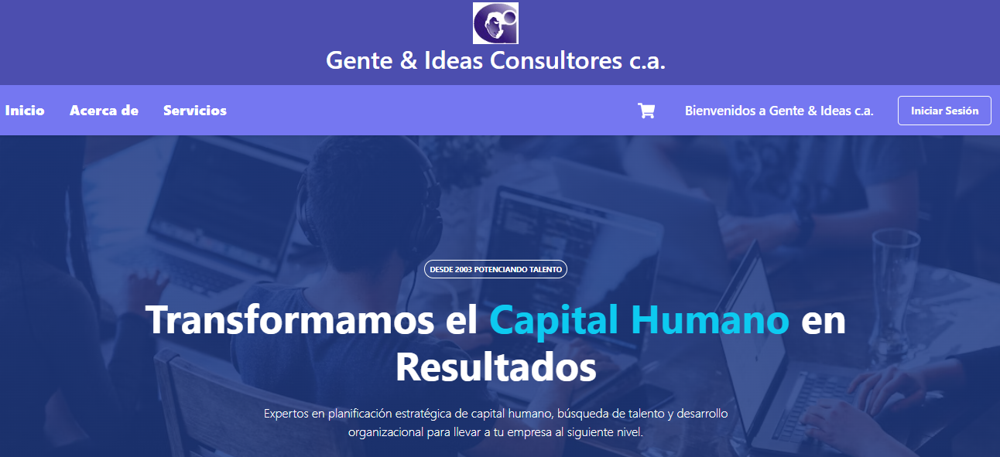

## E-commerce con React + vite ##
La página tiene como propósito facilitar a los clientes que necesitan servicios en materia de RRHH conocer los que puede ofrecer Gente & Ideas Consultores. Se aplicó la funcionalidad de un carrito de compras para hacer las solicitudes de consultas.

En su construcción utilizamos: componentes, props, estado y manejo de eventos. 
También buscamos seguir las buenas prácticas y alcanzamos el despliegue  final de aplicaciones.

Utilizamos React + Vite, MockAPI, Bootstrap, Git, Github.

**Ejemplos de código React  🚀**

